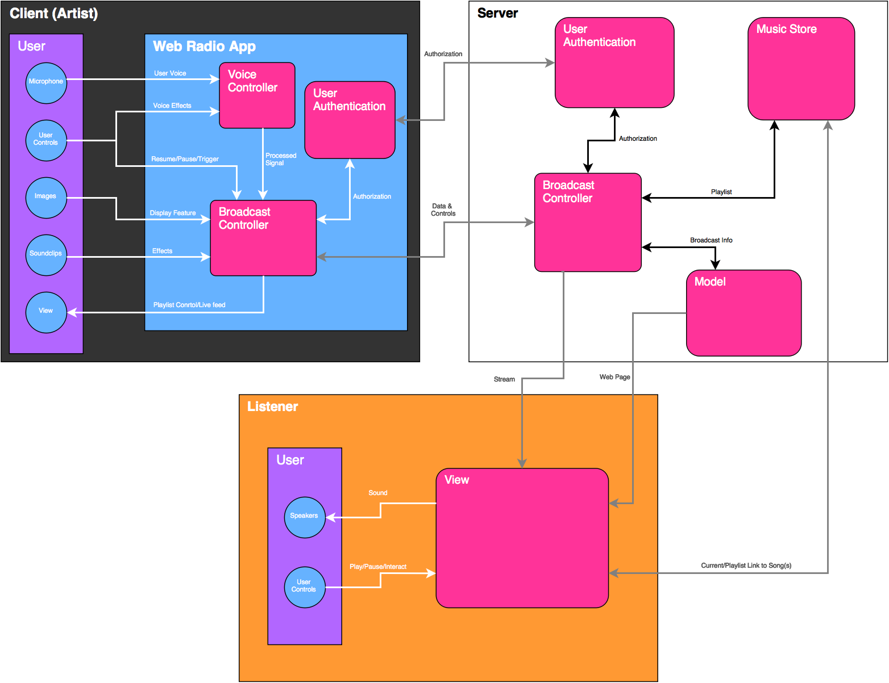

- [Readme](#sec-1)
  - [System Overview](#sec-1-1)
- [Broadcast Controller](#sec-2)
  - [Host](#sec-2-1)
    - [States](#sec-2-1-1)
  - [Server](#sec-2-2)
    - [Online/Offline](#sec-2-2-1)
    - [Preroll](#sec-2-2-2)
    - [Host's Voice](#sec-2-2-3)
    - [Play song](#sec-2-2-4)
    - [Change song](#sec-2-2-5)
  - [Listener](#sec-2-3)
    - [Online/Offline](#sec-2-3-1)
    - [Stream](#sec-2-3-2)
- [Host Interface](#sec-3)
  - [Show Controls](#sec-3-1)
  - [Visual Feedback View](#sec-3-2)
  - [Song Gallery](#sec-3-3)
  - [Playlist](#sec-3-4)
  - [Text Chat View](#sec-3-5)
- [Server API](#sec-4)

# Readme

An easy way to create your own radio show.

## System Overview

# Broadcast Controller

This is a brief description of what kind of functionallity the broadcast controller contains. There are 3 main components: Host, Server, Listener. These share some functionallity with each other, mostly between the Host and Server. The controller will also be time sensitive due to streaming audio.

For now, functionallity is described in point form. There's no flow control map yet, state changes are only described at the moment.

The Host is the radio host or DJ if you will.

The Server is where all the data is pieced together to create the radio show.

The Listener is the viewer that will hear the completed stream.

## Host

### States

1.  Online/Offline

    -   Changes Live state for the broadcast

2.  Preroll

    -   if preroll is set
        -   Rolls when broadcast goes online
    -   trigger when finished
        -   host's voice
        -   song playlist

3.  Host's Voice

    -   enable microphone
    -   microphone capture data transfer to server

4.  Play song

    -   disable microphone
    -   no audio data transfer on host's machine

5.  Change song

    -   automated/manual signal

## Server

### Online/Offline

-   recieve signal from host to start broadcast
-   start output buffer to Listeners

### Preroll

-   if preshow is set
    -   load preroll
    -   start dataflow
-   signal host's machine on/close to finish of preroll

### Host's Voice

-   dataflow from host's machine

### Play song

-   stop dataflow from host's machine
-   load song
-   output song to output buffer Listeners

### Change song

-   recieve signal from host's machine
-   gather info for the next song
-   start play song state change

## Listener

### Online/Offline

-   load listener page

### Stream

# Host Interface

This is where the DJ creates every part of their radio show.

## Show Controls

## Visual Feedback View

## Song Gallery

## Playlist

## Text Chat View

# Server API
